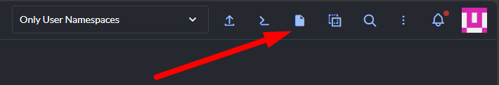

# 🎓 Kubernetes Workshop — From Local to Deployed

## Overview

This workshop covers the complete journey of deploying an application to our K3s Kubernetes cluster at `container.dev.local`. By the end, every developer will be able to:

1. Clone a repo and create a personal branch
2. Build a container image from their app
3. Push it to our internal registry
4. Deploy it to the cluster
5. Access it via a unique subdomain
6. Connect to PostgreSQL and other internal services
7. Use the integrated n8n bot
8. Update environment variables via Rancher or manifests
9. Troubleshoot common issues

**Time estimate:** 45–60 minutes

**Tech stack:** SAP CAP (Node.js) + OpenUI5 frontend

---

## Prerequisites

Before we start, everyone needs these tools installed.

### Install kubectl

**Windows (PowerShell as Administrator):**
```powershell
# Option 1: Using winget
winget install Kubernetes.kubectl

# Option 2: Manual download
curl.exe -LO "https://dl.k8s.io/release/v1.32.0/bin/windows/amd64/kubectl.exe"
Move-Item kubectl.exe C:\Windows\System32\kubectl.exe

# Verify
kubectl version --client
```

**WSL2 (Ubuntu):**
```bash
curl -LO "https://dl.k8s.io/release/$(curl -L -s https://dl.k8s.io/release/stable.txt)/bin/linux/amd64/kubectl"
chmod +x kubectl
sudo mv kubectl /usr/local/bin/
kubectl version --client
```

### Install Podman (for building images)

**Windows:**

Download and install Podman Desktop from https://podman-desktop.io/. It includes the `podman` CLI. After installation:

```powershell
# Verify installation
podman --version

# Initialize the Podman machine (first time only)
podman machine init
podman machine start
```

**WSL2 (Ubuntu):**
```bash
sudo apt update
sudo apt install -y podman
podman --version
```

### Install Git

**Windows:**
```powershell
winget install Git.Git
# Restart terminal after install
git --version
```

**WSL2 (Ubuntu):**
```bash
sudo apt install -y git
git --version
```

### Get Your Kubeconfig

The kubeconfig is your personal access credential to the cluster. Each developer gets their own.

1. Open https://rancher.container.dev.local in your browser
2. Accept the TLS warning (self-signed certificate)
3. Log in with the credentials the admin gave you
4. Select "local" cluster:


5. Click on **kubeconfig file**



6. A "local.yaml" file will be downloaded. Open it and copy it's content.

**Save it — Windows (PowerShell):**
```powershell
mkdir $HOME\.kube -Force
Get-Clipboard | Set-Content $HOME\.kube\config
```

**Save it — WSL2:**
```bash
mkdir -p ~/.kube
nano ~/.kube/config
# Paste, then Ctrl+O to save, Ctrl+X to exit
```

**Required edit (both platforms):** Open the file and make these changes:

1. **Add** `insecure-skip-tls-verify: true` under the `cluster:` section
2. **Remove** the `certificate-authority-data:` line (if present)

The cluster section should look like:
```yaml
clusters:
- name: "local"
  cluster:
    server: "https://rancher.container.dev.local/k8s/clusters/local"
    insecure-skip-tls-verify: true    # ← ADD THIS LINE
```

**Test it:**
```bash
kubectl get pods -A
# You should see a list of running pods across multiple namespaces
```

### Verify Registry Access

**WSL2:**
```bash
curl -k https://registry.container.dev.local/v2/_catalog
```

**Windows PowerShell:**
```powershell
curl.exe -k https://registry.container.dev.local/v2/_catalog
```

Should return: `{"repositories":["in-mcp/atlassian","in-mcp/sap","mcp/sap-docs","sopaai/api","sopaai/backend"]}`

### Verify DNS

```bash
ping workshop-test.container.dev.local
# Should resolve to 10.66.130.65
```

If it doesn't resolve, your machine isn't using the corporate DNS servers. Contact IT.

---

## Part 1: Concepts (10 min)

### What is Kubernetes?

Think of it as an orchestrator that manages your containers. Instead of SSHing into a server and running `docker run`, you describe **what** you want (a YAML file) and Kubernetes makes it happen.

Key concepts:
- **Pod** — A running container (like `docker run`)
- **Deployment** — Manages pods, handles restarts, scaling
- **Service** — Internal DNS name for a pod (like a hostname)
- **Ingress** — External URL routing (the subdomain people use)
- **Secret** — Stores sensitive data (passwords, API keys). Values are base64 **encoded** (NOT encrypted — it's just a transport format). In Rancher UI you can view and edit secrets in plain text.
- **Namespace** — Folder-like isolation for grouping resources

### Our Cluster Architecture

```
Internet → Corporate DNS → dnsmasq (*.container.dev.local)
                                ↓
                        Traefik (:443 TLS)
                                ↓
         ┌──────────────┬───────────────┬────────────────┐
         │   apps ns    │ services ns   │   sandbox ns   │
         │  pgAdmin     │  n8n          │  your app!     │
         │  OriseX      │               │                │
         └──────┬───────┴───────────────┴────────┬───────┘
                │                                │
         ┌──────┴────────────────────────────────┴───────┐
         │                  data ns                       │
         │          PostgreSQL   Qdrant                   │
         └────────────────────────────────────────────────┘
```

### How URLs Work

Our server has **wildcard DNS**: any subdomain ending in `.container.dev.local` automatically resolves to the server. You don't need to register new subdomains or ask IT — just pick a name and use it in your Ingress resource.

When the browser connects, **Traefik** reads the `Host` header and checks all Ingress resources to find which Service to route to. One line in the Ingress YAML defines your URL.

---

## Part 2: Clone the Repo & Create Your Branch (5 min)

### 2.1 Clone the Repository

```bash
git clone https://github.com/rafaelcaziraghi/k8s-workshop-demo.git
cd k8s-workshop-demo
```

### 2.2 Create Your Personal Branch

Each participant works on their own branch. Use your first and last name (lowercase, no spaces):

```bash
# Create and switch to your branch
git checkout -b workshop/<yourname>

# Examples:
# git checkout -b workshop/rafaelcaziraghi
# git checkout -b workshop/afonsoungaro
# git checkout -b workshop/rafaellopes
```

### 2.3 Verify

```bash
git branch
# Should show: * workshop/<yourname>
```

As you work through the workshop, commit your changes:

```bash
# After customizing your manifests
git add .
git commit -m "feat: customized manifests for <yourname>"

# Push your branch
git push origin workshop/<yourname>
```

---

## Part 3: The Application (5 min)

Our demo app uses **SAP CAP** (Cloud Application Programming Model) with an **OpenUI5** frontend. It demonstrates:

- Health check endpoints (required by K8s)
- PostgreSQL database connectivity
- Internal service communication (K8s DNS)
- External API calls (corporate proxy)
- Environment variable configuration
- Integrated n8n bot chat

### Project Structure

```
k8s-workshop-demo/
├── srv/
│   ├── server.js                     # Custom CAP server with API routes
│   └── workshop-service.cds          # CDS service definition
├── app/
│   ├── Component.js                  # App Component definition
│   ├── manifest.json                 # App configuration & descriptor
│   ├── index.html                    # Bootstrap file
│   ├── bot.html                      # n8n embedded chat bot
│   ├── view/                         # XML Views (App, Dashboard, Notes, Participants)
│   ├── controller/                   # Controllers (Logic for each View)
│   └── i18n/                         # Internationalization (Text bundles)
├── db/
│   └── schema.cds                    # CDS data model
├── k8s/
│   ├── step1-basic.yaml              # Basic deployment (no database)
│   ├── step2-with-database.yaml      # + PostgreSQL connection + Secret
│   └── step3-full.yaml               # + proxy, internal services, bot
├── Dockerfile                        # Multi-stage build
├── .dockerignore
├── .gitignore
├── package.json
├── WORKSHOP.md
└── README.md
```

### Run Locally First

```bash
cd k8s-workshop-demo
npm install
npm run dev
# Open http://localhost:4004
```

> **Note on Data Persistence:** When running locally with `npm run dev`, CAP uses an **in-memory SQLite database**.
> This means **all data is lost when you restart the server**.
> This is why we deploy to Kubernetes with PostgreSQL — to have persistent data!

You'll see the OpenUI5 dashboard. Notice the database and network features show "not configured" — we'll enable those in K8s.

Click the **Bot** button in the top right to see the integrated n8n chat page.

---

## Part 4: Build & Push the Image (10 min)

> **Important:** Everything in this section is done on **your local machine**. No server SSH needed.

### 4.1 Choose Your Unique Name

Each participant uses their own name to create a unique deployment. Replace `<yourname>` with your first and last name (lowercase, no spaces) throughout this workshop.

Examples: `workshop-rafaelcaziraghi`, `workshop-afonsoungaro`, `workshop-rafaellopes`

### 4.2 Build the Image

```bash
cd k8s-workshop-demo

# Build the image — replace <yourname> with your name
podman build -t registry.container.dev.local/workshop/<yourname>:v1.0 .
```

**Understanding the image name:**
```
registry.container.dev.local / workshop / <yourname> : v1.0
│                              │          │             │
│                              │          │             └── Tag (version)
│                              │          └── Your unique image name
│                              └── Project name (shared by all workshop participants)
└── Registry address
```

Verify the build:
```bash
podman images | grep workshop
```

### 4.3 Push to the Internal Registry

```bash
# Push to the registry — --tls-verify=false because of self-signed cert
podman push --tls-verify=false registry.container.dev.local/workshop/<yourname>:v1.0
```

The **repository is created automatically** on first push. No pre-creation needed.

Verify it's there:

**WSL2:**
```bash
curl -k https://registry.container.dev.local/v2/workshop/<yourname>/tags/list
```

**Windows PowerShell:**
```powershell
curl.exe -k https://registry.container.dev.local/v2/workshop/<yourname>/tags/list
```

Expected: `{"name":"workshop/<yourname>","tags":["v1.0"]}`

You can also check in the Registry UI: https://registry-ui.container.dev.local

---

## Part 5: Deploy — Step 1: Basic (10 min)

### 5.1 Prepare the Namespace

The `sandbox` namespace already exists and is ready to use.

> **NOTE:**
> The instructions below are not needed for this tutorial!
> They are here for reference if you ever need to create a new namespace for a different project.

```bash
# Create a namespace (example — NOT needed for this workshop)
kubectl create namespace my-project-ns

# Copy TLS certificate to the new namespace (required for HTTPS)
kubectl get secret traefik-tls -n platform -o yaml | \
  sed 's/namespace: platform/namespace: my-project-ns/' | \
  kubectl apply -f -
```

### 5.2 Customize the Manifest

Open `k8s/step1-basic.yaml` and replace all occurrences of `<yourname>` with your unique name:

- Deployment name: `workshop-<yourname>`
- Container image: `registry.container.dev.local/workshop/<yourname>:v1.0`
- Service name: `workshop-<yourname>`
- Ingress name: `workshop-<yourname>`
- Ingress host: `workshop-<yourname>.container.dev.local`
- Labels: `app: workshop-<yourname>`
- App name env var: `workshop-<yourname>`

Here's the full manifest — **copy this and replace `<yourname>`:**

```yaml
apiVersion: apps/v1
kind: Deployment
metadata:
  name: workshop-<yourname>
  namespace: sandbox
spec:
  replicas: 1
  selector:
    matchLabels:
      app: workshop-<yourname>
  template:
    metadata:
      labels:
        app: workshop-<yourname>
    spec:
      containers:
        - name: workshop-<yourname>
          image: registry.container.dev.local/workshop/<yourname>:v1.0
          imagePullPolicy: Always
          ports:
            - containerPort: 4004
          env:
            - name: NODE_ENV
              value: "production"
            - name: PORT
              value: "4004"
            - name: APP_NAME
              value: "workshop-<yourname>"
            - name: APP_VERSION
              value: "1.0"
            - name: FEATURE_GREETING
              value: "Hello from <yourname>'s deployment! 🚀"
            - name: FEATURE_COLOR
              value: "#4ade80"
          livenessProbe:
            httpGet:
              path: /health
              port: 4004
            initialDelaySeconds: 15
            periodSeconds: 15
          readinessProbe:
            httpGet:
              path: /health
              port: 4004
            initialDelaySeconds: 10
            periodSeconds: 5
---
apiVersion: v1
kind: Service
metadata:
  name: workshop-<yourname>
  namespace: sandbox
spec:
  selector:
    app: workshop-<yourname>
  ports:
    - port: 4004
      targetPort: 4004
---
apiVersion: networking.k8s.io/v1
kind: Ingress
metadata:
  name: workshop-<yourname>
  namespace: sandbox
  annotations:
    traefik.ingress.kubernetes.io/router.tls: "true"
spec:
  rules:
    - host: workshop-<yourname>.container.dev.local
      http:
        paths:
          - path: /
            pathType: Prefix
            backend:
              service:
                name: workshop-<yourname>
                port:
                  number: 4004
  tls:
    - hosts:
        - workshop-<yourname>.container.dev.local
      secretName: traefik-tls
```

### 5.3 Deploy

```bash
kubectl apply -f k8s/step1-basic.yaml

# Watch it start
kubectl get pods -n sandbox -w
# Wait for READY 1/1, then Ctrl+C
```

> **How to Stop/Remove it:**
> If you want to delete your deployment (to start over or stop it):
> ```bash
> kubectl delete -f k8s/step1-basic.yaml
> ```
> This removes the Deployment, Service, and Ingress defined in the file.

### 5.4 Verify

```bash
# Test from CLI (WSL2)
curl -k https://workshop-<yourname>.container.dev.local/ -o /dev/null -w "%{http_code}"

# Windows PowerShell
curl.exe -k https://workshop-<yourname>.container.dev.local/ -o NUL -w "%{http_code}"
```

**Now open in your browser:** `https://workshop-<yourname>.container.dev.local`

You should see the OpenUI5 dashboard with:
- ✅ App info showing your name
- ⚠️ **Database: "Not Configured"** (This is expected! We haven't added the DB secret yet.)
- Network test buttons

Click the **Bot** button in the header — you'll see the n8n chat page (it will connect to the n8n webhook once you deploy step 3 with the full config).

### 5.5 What Just Happened?

The YAML file created three resources:

1. **Deployment** — Told K8s: "Run one pod with this image, these env vars, and check /health every 15s"
2. **Service** — Created internal DNS: `workshop-<yourname>.sandbox.svc.cluster.local:4004`
3. **Ingress** — Told Traefik: "Route `workshop-<yourname>.container.dev.local` to this service"

The URL works automatically because wildcard DNS resolves `*.container.dev.local` → the server, and Traefik matches the hostname to your Ingress.

```bash
# See all three resources
kubectl get deploy,svc,ingress -n sandbox
```

### 5.6 Commit Your Progress

```bash
git add k8s/step1-basic.yaml
git commit -m "feat: step1 basic deployment for <yourname>"
```

---

## Part 6: Add Database — Step 2 (10 min)

### 6.1 Create the Database

> This step is done by the admin. For the workshop, the admin will run this:

```bash
kubectl exec -it deploy/postgres -n data -- psql -U postgres -c "CREATE DATABASE workshop;"
kubectl exec -it deploy/postgres -n data -- psql -U postgres -c "CREATE USER workshop_user WITH PASSWORD 'workshop_pass_123';"
kubectl exec -it deploy/postgres -n data -- psql -U postgres -c "GRANT ALL PRIVILEGES ON DATABASE workshop TO workshop_user;"
```

All participants will share this database for the workshop.

### 6.2 Prepare the Secret

Secrets hold sensitive data like passwords. The values in the YAML must be base64 encoded.

**base64 is ENCODING, not ENCRYPTION.** Anyone can decode it. It's just how K8s stores data in YAML files. In Rancher UI, you see and edit secrets in plain text — Rancher handles the encoding for you.

Encode the password:

**WSL2 / Linux:**
```bash
echo -n 'workshop_pass_123' | base64
# Output: d29ya3Nob3BfcGFzc18xMjM=
```

**Windows PowerShell:**
```powershell
[Convert]::ToBase64String([Text.Encoding]::UTF8.GetBytes("workshop_pass_123"))
# Output: d29ya3Nob3BfcGFzc18xMjM=
```

### 6.3 Deploy with Database Config

Update your manifest (or use `k8s/step2-with-database.yaml` as a base, replacing `<yourname>`):

```yaml
# --- Secret ---
apiVersion: v1
kind: Secret
metadata:
  name: workshop-<yourname>-secret
  namespace: sandbox
type: Opaque
data:
  # echo -n 'workshop_pass_123' | base64
  DB_PASSWORD: d29ya3Nob3BfcGFzc18xMjM=
---
apiVersion: apps/v1
kind: Deployment
metadata:
  name: workshop-<yourname>
  namespace: sandbox
spec:
  replicas: 1
  selector:
    matchLabels:
      app: workshop-<yourname>
  template:
    metadata:
      labels:
        app: workshop-<yourname>
    spec:
      # --- Init Container ---
      initContainers:
        - name: schema-deploy
          image: registry.container.dev.local/workshop/<yourname>:v1.0
          imagePullPolicy: Always
          command: ["npx", "cds", "deploy"]
          env:
            - name: NODE_ENV
              value: "production"
            - name: CDS_REQUIRES_DB_KIND
              value: "postgres"
            - name: CDS_REQUIRES_DB_CREDENTIALS_HOST
              value: "postgres.data.svc.cluster.local"
            - name: CDS_REQUIRES_DB_CREDENTIALS_PORT
              value: "5432"
            - name: CDS_REQUIRES_DB_CREDENTIALS_DATABASE
              value: "workshop"
            - name: CDS_REQUIRES_DB_CREDENTIALS_USER
              value: "workshop_user"
            - name: CDS_REQUIRES_DB_CREDENTIALS_PASSWORD
              valueFrom:
                secretKeyRef:
                  name: workshop-<yourname>-secret
                  key: DB_PASSWORD
      containers:
        - name: workshop-<yourname>
          image: registry.container.dev.local/workshop/<yourname>:v1.0
          imagePullPolicy: Always
          ports:
            - containerPort: 4004
          env:
            - name: NODE_ENV
              value: "production"
            - name: PORT
              value: "4004"
            - name: APP_NAME
              value: "workshop-<yourname>"
            - name: APP_VERSION
              value: "1.0"
            - name: FEATURE_GREETING
              value: "Now with database! 🚀"
            - name: FEATURE_COLOR
              value: "#4ade80"
            # --- Database connection ---
            - name: DB_HOST
              value: "postgres.data.svc.cluster.local"
            - name: DB_PORT
              value: "5432"
            - name: DB_NAME
              value: "workshop"
            - name: DB_USER
              value: "workshop_user"
            - name: DB_PASSWORD
              valueFrom:
                secretKeyRef:
                  name: workshop-<yourname>-secret
                  key: DB_PASSWORD
          livenessProbe:
            httpGet:
              path: /health
              port: 4004
            initialDelaySeconds: 15
            periodSeconds: 15
          readinessProbe:
            httpGet:
              path: /health
              port: 4004
            initialDelaySeconds: 10
            periodSeconds: 5
---
apiVersion: v1
kind: Service
metadata:
  name: workshop-<yourname>
  namespace: sandbox
spec:
  selector:
    app: workshop-<yourname>
  ports:
    - port: 4004
      targetPort: 4004
---
apiVersion: networking.k8s.io/v1
kind: Ingress
metadata:
  name: workshop-<yourname>
  namespace: sandbox
  annotations:
    traefik.ingress.kubernetes.io/router.tls: "true"
spec:
  rules:
    - host: workshop-<yourname>.container.dev.local
      http:
        paths:
          - path: /
            pathType: Prefix
            backend:
              service:
                name: workshop-<yourname>
                port:
                  number: 4004
  tls:
    - hosts:
        - workshop-<yourname>.container.dev.local
      secretName: traefik-tls
```

Apply it:
```bash
kubectl apply -f k8s/step2-with-database.yaml
```

### 6.4 What Changed?

We added:
- A **Secret** containing the DB password (base64 encoded)
- New env vars: `DB_HOST`, `DB_PORT`, `DB_NAME`, `DB_USER`
- `DB_PASSWORD` uses `valueFrom: secretKeyRef` to reference the Secret — the actual password never appears in the Deployment

### 6.5 Verify

Refresh `https://workshop-<yourname>.container.dev.local` — the database card should show **✅ Connected**.

Click **"Test Query"** to run a live SQL query against PostgreSQL.

**Key concept:** The app connects to `postgres.data.svc.cluster.local:5432` — this is **cross-namespace** communication. Your app is in `sandbox`, PostgreSQL is in `data`. K8s DNS makes this seamless.

### 6.6 Commit

```bash
git add k8s/step2-with-database.yaml
git commit -m "feat: step2 database connectivity for <yourname>"
```

---

## Part 7: Full Features — Step 3 (5 min)

### 7.1 Deploy Full Config

Update your manifest to add internal service communication, proxy config, and the bot URL (or use `k8s/step3-full.yaml` as base, replacing `<yourname>`). The new additions are:

```yaml
            # --- Internal Service Communication (K8s DNS) ---
            - name: INTERNAL_SERVICE_URL
              value: "http://n8n.services.svc.cluster.local:5678/healthz"

            # --- Bot Configuration ---
            - name: N8N_CHAT_URL
              value: "https://n8n-dev.container.dev.local/webhook/0a7daf42-4283-4b04-8b1a-4a0d60186e49/chat"

            # --- Corporate Proxy (for external API calls) ---
            - name: HTTP_PROXY
              value: "http://10.55.0.55:80"
            - name: HTTPS_PROXY
              value: "http://10.55.0.55:80"
            - name: NO_PROXY
              value: "localhost,127.0.0.1,postgres.data.svc.cluster.local,n8n.services.svc.cluster.local,10.42.0.0/16,10.43.0.0/16,.container.dev.local,.svc,.cluster.local"
```

Apply and refresh the dashboard. Test:
- **Test Internal Service** — Calls n8n's health endpoint via K8s DNS
- **Test External API** — Calls httpbin.org through the corporate proxy (using undici ProxyAgent)
- **Test DNS Resolution** — Shows how K8s DNS resolves service names to IPs
- **Bot page** — Click the **Bot** button to chat with the n8n workflow bot

**⚠️ Node.js proxy note:** Node.js native `fetch()` ignores `HTTP_PROXY`/`HTTPS_PROXY` env vars. Our app uses undici's `ProxyAgent` explicitly — this is the correct pattern for any Node.js/CAP app behind a corporate proxy.

### 7.2 Commit

```bash
git add k8s/step3-full.yaml
git commit -m "feat: step3 full deployment for <yourname>"
git push origin workshop/<yourname>
```


---

## Part 8: The "Best Practice" — Init Containers (5 min)

You might wonder: "How does the database schema get created?"

In this workshop, we use a **Kubernetes Init Container** pattern.

### Why not just run `cds deploy` in the main container?
We could, but that mixes "deploy time" tasks with "run time" tasks. If your app crashes and restarts, you don't want it attempting to deploy the schema every single time. 

### The Init Container Pattern
We added an `initContainers` section to our Deployment.
1. K8s starts the **Init Container** first.
2. It runs `npx cds deploy`.
3. **Schema Evolution**: CAP automatically detects if the table structure changed and applies non-destructive updates (`schema_evolution: auto`).
4. If successful, the Init Container dies.
5. Only then does the **Main Container** (your app) start.

This ensures:
- The DB is always ready before the app accepts traffic.
- If deployment fails, the app doesn't start (Deployment status stays at `Init:CrashLoopBackOff`, making it obvious there's a DB issue).

---

## Part 9: The Bot Page (5 min)

The app includes an integrated chat bot powered by n8n workflow automation.

### How It Works

1. The **Bot** button in the dashboard header navigates to `/bot.html`
2. This page loads the n8n embedded chat widget
3. The widget connects to the n8n webhook URL configured via the `N8N_CHAT_URL` environment variable
4. Messages go to n8n → workflow processes them → response comes back

### Default Bot URL

```
https://n8n-dev.container.dev.local/webhook/0a7daf42-4283-4b04-8b1a-4a0d60186e49/chat
```

This is configurable — to point to a different n8n workflow, change the `N8N_CHAT_URL` env var in your deployment (via Rancher or manifest).

### Try It

1. Open `https://workshop-<yourname>.container.dev.local`
2. Click the **Bot** button in the top right
3. Type a message and send it
4. The n8n workflow will process your message and respond

---

## Part 9: Live Updates via Rancher (5 min)

This is the power of Kubernetes + Rancher — no CLI needed for config changes.

### 9.1 Change an Environment Variable

1. Open https://rancher.container.dev.local
2. Navigate: **local** → **sandbox** namespace → **Deployments** → **workshop-\<yourname\>**
3. Click **⋮** → **Edit Config**
4. Scroll to **Environment Variables**
5. Change `FEATURE_GREETING` to something custom
6. Change `FEATURE_COLOR` to `#ef4444` (red)
7. Click **Save**

Rancher automatically restarts the pod. Refresh the browser — changes are live!

**⚠️ Note:** Changes in Rancher are immediate but are NOT saved in your manifest file. If you re-apply the manifest later, Rancher changes are overwritten. For permanent changes, always update the manifest file too.

### 9.2 Edit a Secret in Rancher

1. Go to **sandbox** namespace → **Secrets** → **workshop-\<yourname\>-secret**
2. Click **⋮** → **Edit**
3. You see values in **plain text** — no base64 needed here
4. Add or change values, then **Save**
5. Restart the deployment: **Deployments** → **workshop-\<yourname\>** → **⋮** → **Redeploy**

### 9.3 View Logs in Rancher

1. Go to **Pods** → click on your workshop pod
2. Click **Logs** tab — live container output
3. Click **Shell** tab — terminal inside the container

### 9.4 Scale the Deployment

1. Go to **Deployments** → **workshop-\<yourname\>**
2. Click the **+** button to scale to 2 replicas
3. Refresh the dashboard multiple times — notice the **Hostname** changes (load balancing!)

---

## Part 10: Updating a Deployed App (Real-World Scenario)

### Scenario: Your app needs a new environment variable

Three ways to do it:

### Option A: Rancher UI (fastest, but not saved in manifest)

1. Rancher → **sandbox** → **Deployments** → **workshop-\<yourname\>**
2. **⋮** → **Edit Config** → Add variable → **Save**
3. Pod restarts automatically

Good for: quick testing, temporary changes.

### Option B: kubectl edit (same result, different interface)

```bash
kubectl edit deploy/workshop-<yourname> -n sandbox
# Find the env: section, add your variable, save (:wq)
# Pod restarts automatically
```

### Option C: Update the manifest (permanent — recommended)

1. Edit your `k8s/` YAML file locally
2. Add the new variable
3. Re-apply:
   ```bash
   kubectl apply -f k8s/step3-full.yaml
   ```

**Best practice:** Always update the manifest file so changes are version-controlled and survive re-deployments.

### Deploying New Code

When you change the application code:

```bash
# 1. Build new image with new tag (on your local machine)
podman build -t registry.container.dev.local/workshop/<yourname>:v2.0 .

# 2. Push to registry
podman push --tls-verify=false registry.container.dev.local/workshop/<yourname>:v2.0

# 3. Update the image tag in your manifest file, then:
kubectl apply -f k8s/<your-manifest>.yaml

# 4. Watch the rollout
kubectl rollout status deploy/workshop-<yourname> -n sandbox
```

kubectl set image deploy/workshop-<yourname> workshop-<yourname>=registry.container.dev.local/workshop/<yourname>:v2.0 -n sandbox
```

### ⚠️ The "Same Tag" Trap

**Problem:** If you rebuild your image but keep the **same tag** (e.g. `v1.0`) and push it, Kubernetes might not download the new image if it thinks it already has it.

**Solution:**
We have added `imagePullPolicy: Always` to your deployment manifests. This tells Kubernetes: "Don't trust the cache. Always check the registry for a newer version."

**However**, you still need to tell Kubernetes to **restart the pod** to trigger this pull.

**How to update your running app:**

1. **Rebuild & Push** your image.
2. **Restart the Pod**:
   ```bash
   # Option A: Delete and Re-apply (Easiest)
   kubectl delete -f k8s/step3-full.yaml
   kubectl apply -f k8s/step3-full.yaml

   # Option B: Rollout Restart (Zero downtime-ish)
   kubectl rollout restart deploy/workshop-<yourname> -n sandbox
   ```

**How to fix it:**
1. **Best Practice:** Always use a new tag (`v1.1`, `v1.2`) for every change.
2. **Alternative:** Force a pull by adding this to your deployment YAML (under `containers:`):
   ```yaml
   imagePullPolicy: Always
   ```
   Then run `kubectl apply` and restart the pod (`kubectl delete pod ...`).
3. **Nuclear Option:** Delete the deployment entirely (`kubectl delete -f ...`) and re-apply. (Only works if `imagePullPolicy: Always` is set or if the node cache is cleared, so option #1 or #2 is better).

### Rolling Back

If something goes wrong:
```bash
kubectl rollout undo deploy/workshop-<yourname> -n sandbox
```

### Push Everything to Git

```bash
git add .
git commit -m "feat: workshop complete for <yourname>"
git push origin workshop/<yourname>
```

---

## Part 11: Cleanup

```bash
# Delete your deployment
kubectl delete -f k8s/step3-full.yaml
# (or whichever step file you last applied)

# Verify
kubectl get all -n sandbox
```

---

## Quick Reference Card

### Deploy Flow (everything from your local machine)
```
Code → Dockerfile → podman build → podman push → kubectl apply → Live!
```

### Git Workflow
```bash
git checkout -b workshop/<yourname>      # Create your branch
git add . && git commit -m "message"     # Commit changes
git push origin workshop/<yourname>      # Push to remote
```

### Key Commands
```bash
kubectl get pods -n <ns>                    # List pods
kubectl logs deploy/<app> -n <ns>           # View logs
kubectl describe pod <pod> -n <ns>          # Debug issues
kubectl apply -f <file>.yaml               # Deploy/update
kubectl rollout restart deploy/<app> -n <ns> # Restart
kubectl delete -f <file>.yaml              # Remove
```

### Internal DNS Pattern
```
<service>.<namespace>.svc.cluster.local:<port>
```

### Available Internal Services
| Service | Address |
|---------|---------|
| PostgreSQL | postgres.data.svc.cluster.local:5432 |
| Qdrant | qdrant.data.svc.cluster.local:6333 |
| n8n | n8n.services.svc.cluster.local:5678 |
| OriseX | orisex.apps.svc.cluster.local:3000 |

### Useful URLs
| URL | Purpose |
|-----|---------|
| https://rancher.container.dev.local | Cluster management GUI |
| https://registry-ui.container.dev.local | Container image browser |
| https://pgadmin.container.dev.local | PostgreSQL management |
| https://system.container.dev.local | Server monitoring |

---

## Troubleshooting

| Symptom | Check | Fix |
|---------|-------|-----|
| Pod `Pending` | `kubectl describe pod` | Usually image pull error or PVC issue |
| Pod `CrashLoopBackOff` | `kubectl logs <pod> --previous` | App crash — check env vars, DB connectivity |
| Pod `ImagePullBackOff` | Check image name matches registry | `curl -k https://registry.container.dev.local/v2/_catalog` |
| `502 Bad Gateway` | Pod running? Service port correct? | `kubectl get pods,svc,ingress -n sandbox` |
| DB connection refused | Check DB_HOST value | Must be `postgres.data.svc.cluster.local` |
| External API timeout | Check HTTP_PROXY env var | Must be `http://10.55.0.55:80` — also, Node.js needs undici ProxyAgent |
| Bot not loading | Check N8N_CHAT_URL env var | n8n CDN must be reachable; check proxy config |
| `curl` doesn't work on Windows | Use `curl.exe` in PowerShell | PowerShell's `curl` is an alias for `Invoke-WebRequest` |
| DNS doesn't resolve | Machine not using corporate DNS | Check network settings or contact IT |

---

## Questions?

- **Rancher:** https://rancher.container.dev.local
- **Cluster help:** Rafael Caziraghi
